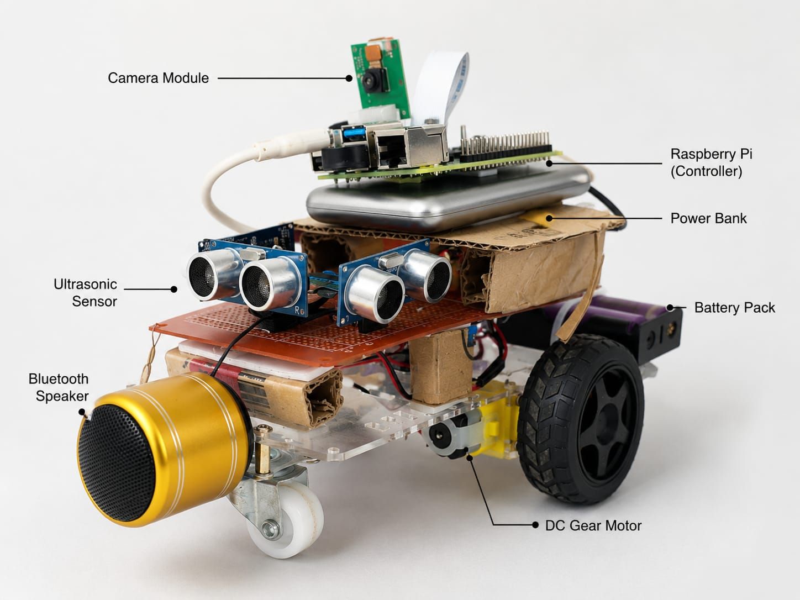

# KANDA — Multimodal Embodied Robot Agent

**KANDA** — Knowledge-driven Autonomous Navigation and Decision-making Agent

A sub-$77 multimodal embodied robot where **Groq Llama 3.3 is the language brain, NVIDIA NIM Llama 3.2 Vision is the eyes, and the ESP32 is the body**. You speak to it naturally; it plans and acts using its camera, sensors, and motors with a three-layer safety architecture.

> **Current version:** [`kanda_v2/`](kanda_v2/) — full async event-driven rewrite (asyncio + event bus, non-blocking).  
> `vision_module/` is the prior stable release kept for reference.

<p align="center">
  
</p>

---

## What KANDA can do

- **"Hey Kanda, go forward"** → validates and executes the motor command
- **"Hey Kanda, find my water bottle"** → searches the room autonomously using episodic visual search
- **"Hey Kanda, what do you see?"** → describes the camera view using NVIDIA NIM VLM
- **"Hey Kanda, stop"** → cancels anything immediately
- **Telegram remote control** → send text, voice notes, or photos via Telegram bot
- **Any natural language instruction** → Groq classifies intent and plans the physical response using full body context (sensors + camera + history)

---

## Architecture: Deliberative–Critic–Reflex

```
┌─────────────────────────────────────────────────────────┐
│                CLOUD TIER (Deliberative)                  │
│   Groq Llama 3.3 (text reasoning, intent, planning)     │
│   NVIDIA NIM Llama 3.2 Vision (scene descriptions)      │
│   Temperature: 0.1 │ Latency: 1.5–4s │ UNTRUSTED       │
└──────────────────────────┬──────────────────────────────┘
                           │ HTTPS (JSON)
┌──────────────────────────▼──────────────────────────────┐
│                 EDGE TIER (Critic)                        │
│              Raspberry Pi 4 (Python 3.10+)               │
│                                                          │
│  Wake Word (openWakeWord) → STT → Intent Classifier     │
│  Body-Context Assembler → LLM Call → Safety Validator    │
│  7-State Machine │ Telegram Bot │ gTTS Speaker           │
│                                                          │
│  Validator V: Any → {action ∈ A, speed ∈ [0,255]}       │
│  42% of raw LLM outputs are structurally unsafe →       │
│  after V, 0% violate safety invariants                   │
└──────────────────────────┬──────────────────────────────┘
                           │ UART 115,200 baud (JSON ↓ telemetry ↑)
┌──────────────────────────▼──────────────────────────────┐
│                DEVICE TIER (Reflex)                       │
│                    ESP32 DevKit                           │
│                                                          │
│  HC-SR04 × 3 (front/left/right) @ 10 Hz                 │
│  Emergency stop: front < 15 cm → motors OFF in 47ms     │
│  TB6612FNG motor driver │ SSD1306 OLED face             │
│  Independent of Pi/cloud — works even if USB unplugged   │
└─────────────────────────────────────────────────────────┘
```

**States:** `IDLE` → `LISTENING` → `THINKING` → `ACTING / SEARCHING` → `SPEAKING` → `REPORTING` → `IDLE`

---

## Hardware (Total: < $77)

| Component | Cost | Purpose |
|-----------|------|---------|
| Raspberry Pi 4 (4 GB) | $35 | Brain — runs AI, camera, voice |
| ESP32 DevKit | $4 | Body — motors, sensors, OLED |
| Pi Camera v2.1 | $10 | Vision input (CSI ribbon) |
| Motor driver + sensors | $5 | TB6612FNG + HC-SR04 × 3 |
| Display, mic, speaker | $10 | SSD1306 OLED, USB mic, BT speaker |
| Chassis, motors, battery | $13 | 2WD chassis + LiPo + power bank |

---

## Quick Start

### Step 1 — Get API keys

| Key | Where |
|-----|-------|
| **Groq** | [console.groq.com](https://console.groq.com) → API Keys — free tier |
| **NVIDIA NIM** | [build.nvidia.com](https://build.nvidia.com) → API Catalog — free tier |

**Wake word uses openWakeWord — no account, no API key, fully offline.**

> **No mic?** Set `KANDA_WAKE_WORD=0` and press **Enter** in the terminal to wake KANDA.

---

### Step 2 — Copy files to Raspberry Pi

```bash
rsync -av kanda/vision_module/ pi@raspberrypi.local:~/kanda/
```

---

### Step 3 — Run setup on the Pi

```bash
cd ~/kanda
chmod +x setup.sh
./setup.sh
```

---

### Step 4 — Flash ESP32

**File:** `vision_module/firmware_phase4.ino`

1. Install [Arduino IDE](https://www.arduino.cc/en/software) (v2.x)
2. Add ESP32 board URL: `https://raw.githubusercontent.com/espressif/arduino-esp32/gh-pages/package_esp32_index.json`
3. Install libraries: **Adafruit GFX**, **Adafruit SSD1306**, **ArduinoJson**
4. Board: `ESP32 Dev Module`, Upload Speed: `115200`
5. Upload → verify Serial Monitor shows sensor readings at 115200 baud
6. Connect ESP32 to Pi via USB

---

### Step 5 — Run KANDA

```bash
cd ~/kanda

export GROQ_API_KEY=your_key_here
export NVIDIA_API_KEY=your_key_here

python3 main.py
```

**Without ESP32** (testing):
```bash
KANDA_NO_UART=1 python3 main.py
```

---

### Step 6 — Talk to it

1. Say **"Hey Kanda"** (or press Enter if `KANDA_WAKE_WORD=0`)
2. KANDA says **"Yes?"** and opens its eyes on the OLED
3. Speak your command — recording stops on silence
4. KANDA classifies intent, plans, validates, and acts

**Example commands:**
```
"go forward"
"find my water bottle"
"what do you see?"
"dance"
"stop"
```

---

## Environment Variables

| Variable | Default | Description |
|----------|---------|-------------|
| `GROQ_API_KEY` | — | **Required.** Groq Cloud API key |
| `NVIDIA_API_KEY` | — | **Required.** NVIDIA NIM API key |
| `KANDA_NO_UART` | `0` | Set to `1` to run without ESP32 |
| `KANDA_SERIAL_PORT` | `/dev/ttyUSB0` | ESP32 USB serial port |
| `GROQ_MODEL` | `llama-3.3-70b-versatile` | Groq model for text reasoning |
| `NVIDIA_VLM_MODEL` | `meta/llama-3.2-11b-vision-instruct` | NVIDIA NIM model for vision |
| `KANDA_WAKE_WORD` | `1` | Set to `0` for keyboard fallback |
| `KANDA_WAKE_WORD_MODEL` | `hey_kanda` | Wake phrase (or path to `.onnx`) |
| `KANDA_WAKE_SENSITIVITY` | `0.5` | Detection threshold (0.0–1.0) |
| `KANDA_VLM_INTERVAL` | `10.0` | Seconds between background scene descriptions |
| `KANDA_VAD_SILENCE` | `1.5` | Silence seconds before recording stops |
| `KANDA_SEARCH_MAX_STEPS` | `20` | Max steps in visual search loop |
| `KANDA_GROQ_TIMEOUT` | `15` | Seconds before API call timeout |

---

## Safety Architecture

KANDA implements a **deliberative–critic–reflex** decomposition inspired by Brooks' subsumption architecture:

| Layer | Location | Timescale | What it does |
|-------|----------|-----------|--------------|
| **Deliberative** | Cloud (Groq/NIM) | 1.5–4 s | Proposes actions grounded in body context |
| **Critic** | Pi (validator) | < 1 ms | Rejects/clamps every command; total function |
| **Reflex** | ESP32 firmware | 47 ms | Halts motors on obstacle, independent of cloud |

**Ablation results** (n=10 per condition):
- Remove scene context → 15% unsafe plans
- Remove episodic memory → 60% redundant search steps  
- Remove firmware reflex → 30% near-miss events
- Raw LLM outputs → 42% structurally unsafe commands

---

## Evaluation Results

| Metric | Result |
|--------|--------|
| Intent classification F1 (60 utterances) | 0.94 |
| Visual search success (10 trials) | 8/10 |
| Fault injection (8 scenarios) | All safe termination |
| Firmware reflex latency | 47 ± 21 ms |
| Cloud inference latency | 1.5–4.0 s |
| Wake word false positive rate | < 2% |

---

## Repository Structure

```
kanda/
├── vision_module/          ← All Pi code (copy this to Pi)
│   ├── main.py             ← Entry point — 7-state machine
│   ├── config.py           ← Settings and State enum
│   ├── body_context.py     ← Robot body awareness (sensors + scene + history)
│   ├── task_agent.py       ← Intent classifier, planner, ReAct search
│   ├── plan_executor.py    ← Executes JSON plans step by step
│   ├── voice_command.py    ← Audio transcription (Groq Whisper)
│   ├── wake_word.py        ← openWakeWord / keyboard fallback
│   ├── mic.py              ← VAD microphone recording
│   ├── speaker.py          ← TTS via gTTS → speaker
│   ├── camera.py           ← RPi Camera v2.1 capture
│   ├── vlm.py              ← Vision-Language Model (NVIDIA NIM)
│   ├── telegram_input.py   ← Telegram bot (text/voice/photo)
│   ├── firmware_phase4.ino ← ESP32 firmware (flash via Arduino IDE)
│   ├── setup.sh            ← Pi setup script
│   └── requirements.txt    ← Python dependencies
├── ai_layer/               ← Earlier prototype (reference)
├── firmware/               ← Phase 2 ESP32 firmware (reference)
├── overleaf/               ← LaTeX report and IEEE paper source
│   ├── chapters/           ← Report chapters 1–9 + annexures
│   ├── paper/kanda.tex     ← IEEE conference paper
│   └── images/             ← Figures and diagrams
└── docs/                   ← Pin config and wiring diagrams
```

---

## How it works

Every inference call receives the **full body context**:

```
You are a robot with two wheels called KANDA.
Capabilities: forward, backward, left, right, slight_left, slight_right, stop.
Speed range: 0–255. Camera resolution: 640×480.
Sensors: Front=30.5cm  Left=18.4cm(WARNING)  Right=62.0cm
Scene: "A desk with laptop and water bottle."
Recent actions: ["forward", "forward", "slight_left"]
State: Searching. Target: "water bottle"
JSON ONLY in your answer.
```

The validator then ensures:
1. Action ∈ {forward, backward, left, right, slight_left, slight_right, stop}
2. Speed ∈ ℤ ∩ [0, 255]
3. Any failure → `{"action": "stop", "speed": 0}`

---

## Troubleshooting

**No audio input detected**
```bash
python3 -c "import pyaudio; pa=pyaudio.PyAudio(); [print(i, pa.get_device_info_by_index(i)['name']) for i in range(pa.get_device_count())]"
```

**ESP32 not found**
```bash
ls /dev/ttyUSB* /dev/ttyACM*
sudo chmod 666 /dev/ttyUSB0
```

**Camera not working**
```bash
libcamera-hello --timeout 2000
```

---

## Project Phases

| Phase | Status | Description |
|-------|--------|-------------|
| 1 — Conceptual Design | ✅ Done | Problem formulation, architecture proposal |
| 2 — Embodiment Layer | ✅ Done | ESP32 + motors + sensors + obstacle avoidance |
| 3 — Intelligence Layer | ✅ Done | Raspberry Pi + LLM + serial bridge |
| 4 — Multimodal Agent | ✅ Done | Vision + voice + wake word + Telegram + safety |

---

## License

MIT
