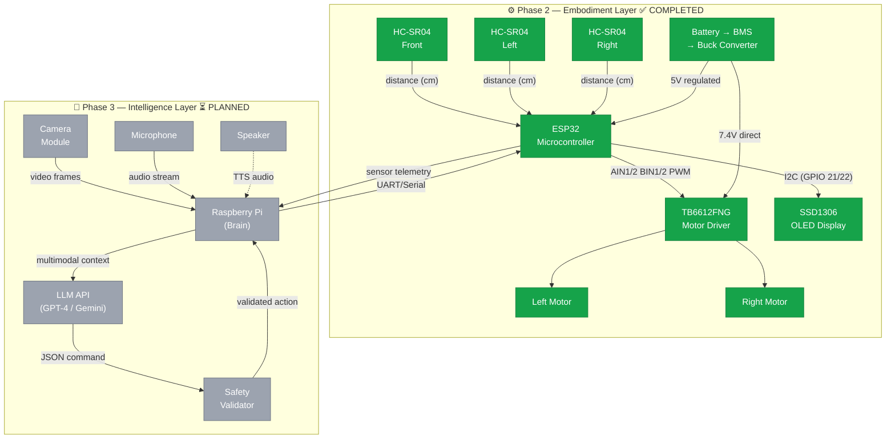
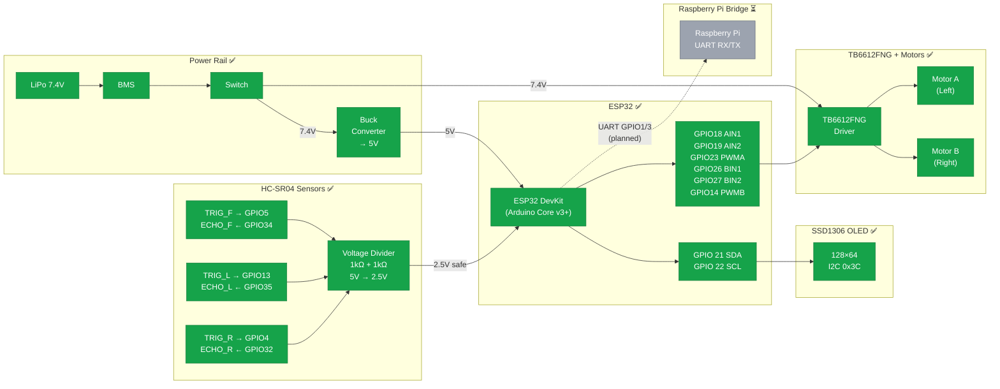
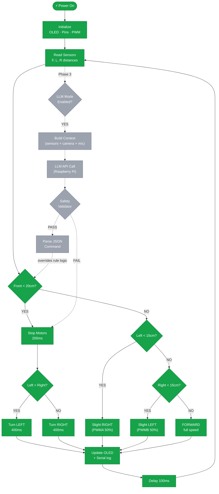
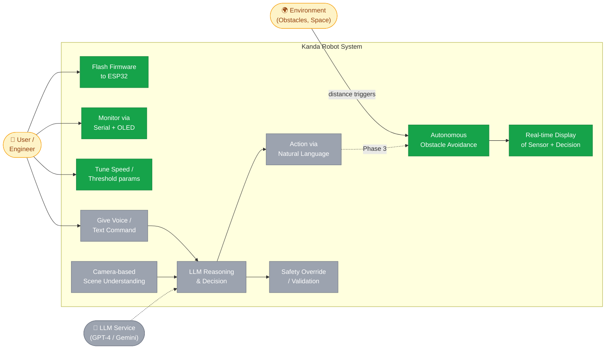

# Kanda Robot — System Diagrams

> **Color convention across all diagrams**
> - 🟢 **Green** = Completed / Implemented
> - ⚫ **Gray** = Planned / Pending

---

## 1. High-Level Design (HLD)

Overall system architecture across all phases.

---

## 2. Low-Level Design (LLD)

Detailed pin-level wiring and signal flow.

---

## 3. Flow Diagram

Decision logic — current rule-based loop and planned LLM loop.

---

## 4. Use Case Diagram

Actor interactions with the system — current and planned.

